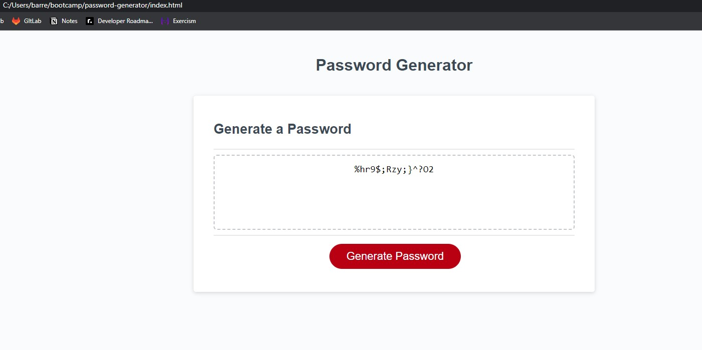

# Password Generator

## Description

This Password Generator was completed to allow users to create passwords based off chosen criteria. This takes away the hassle of creating a password manually.

## Installation

N/A

## Usage

The user will click the button that says "Generate Password" and windows will prompt the user to choose the criteria for the password. If the password length is not between 8 and 128 characters, an error message will prompt instead. Once the criteria is defined, a function, for loop, and method will generate the password on the screen.

## Credits

N/A

## License

Please refer to the LICENSE in the repo.